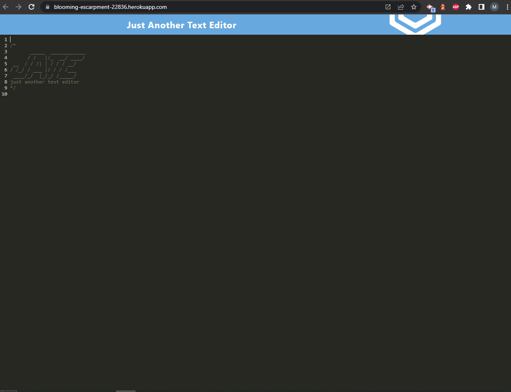

# Just Another Text Editor - PWA conversion

## Description

This project took an already functioning text editor app and converted it to meet the criterea for a progressive web application. Added features include adding a service worker for precaching and offline functionality, adding a manifest.json to make the app downloadable, and adding an IndexedDB database for data persistance. 

The site was deployed to Heroku and can be found [here](https://blooming-escarpment-22836.herokuapp.com/)

